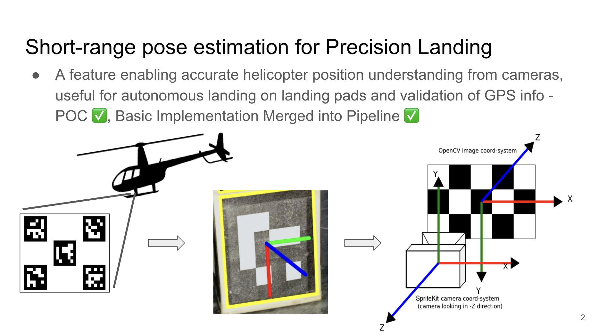

# Precision Landing

A project I worked on during my first internship ever, at Rotor Technologies (early-stage MIT AeroAstro spin-off startup).
Designed a vision-based helicopter precision landing system with PnP pose estimation, lightweight CNNs, & Kalman filtering, deployed in a flight-ready build.
Improved short-range landing accuracy by 75%.

Reach out for more specifics.

