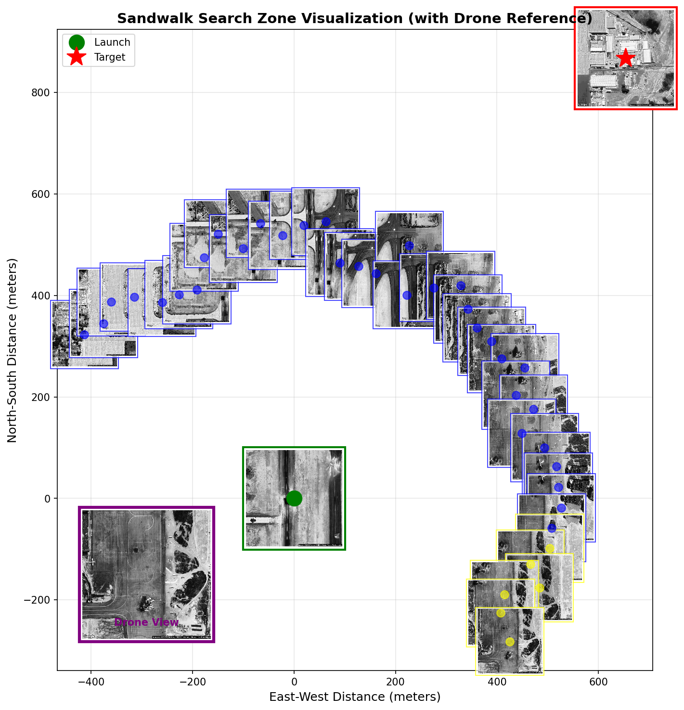

### Background
Modern autonomous drone operations increasingly face GPS-denied or GPS-contested environments where traditional positioning systems are unreliable, jammed, or spoofed. For extended-range missions—whether covert military operations, search and rescue in remote terrain, or operations in electronically hostile environments—drones must navigate without continuous external positioning data while maintaining situational awareness and mission effectiveness.

### Overall Issue
When GPS is unavailable or untrusted, autonomous drones lose their primary means of localization. Dead reckoning using inertial measurement units (IMUs) and motor telemetry degrades rapidly due to sensor drift, accumulating errors of meters per minute. Within minutes of GPS denial, a drone operating on dead reckoning alone may have positional uncertainty of hundreds of meters, rendering precision navigation and payload deployment impossible. Existing vision-based navigation systems either require pre-mapped 3D environments (impractical for dynamic or unfamiliar terrain) or transmit imagery for ground-station processing (compromising operational security and requiring reliable datalinks).

### Solution (So-Far)
Current GPS-denied navigation relies on sensor fusion combining IMU data, barometric altitude, magnetometers, and motor usage estimates. While functional for short durations, these approaches suffer from unbounded drift. Visual odometry can track relative motion but cannot correct absolute position without external reference points. Some systems use SLAM (Simultaneous Localization and Mapping) but require significant onboard computation and struggle in featureless environments like deserts, oceans, or uniform terrain.

### Why This Fails
Dead reckoning fails because errors compound exponentially—a 1% drift in velocity estimation becomes a 60-meter error after just one minute of flight. IMU gyroscope drift, motor inefficiency variations, wind effects, and terrain obstacles all introduce unmodeled errors. Without absolute position correction, even the most sophisticated sensor fusion eventually loses accuracy. Visual odometry works for relative tracking but cannot answer "where am I?" without a known reference frame. SLAM can build local maps but doesn't solve global localization in unknown environments.

### Sandwalk
Sandwalk is an onboard, vision-based absolute positioning system that enables drones to determine their global coordinates in GPS-denied environments using only: (1) known launch location, (2) motor usage telemetry (rough distance traveled), and (3) live camera imagery. Unlike Glasses, which validates arrival at a pre-specified target, Sandwalk continuously localizes the drone anywhere along its flight path by matching observed terrain against satellite imagery within a dynamically constrained search region.

**How it works:**
1. **Launch + Dead Reckoning = Search Region**: Given launch coordinates and estimated distance traveled (from motor usage), Sandwalk calculates a circular search region with radius = estimated_distance ± tolerance_margin
2. **Optional Target Constraint**: If target coordinates are provided, Sandwalk eliminates geometrically implausible regions (e.g., areas opposite the target vector), reducing the search space by 50-75%
3. **Tile-Based Matching**: Sandwalk retrieves satellite imagery tiles covering the search region and performs SIFT-based feature matching between live drone footage and each candidate tile
4. **Position Output**: The tile with highest matching confidence becomes the drone's estimated position, output as latitude/longitude coordinates

**Key Innovation**: Sandwalk transforms unbounded dead-reckoning drift into a bounded search problem. By periodically re-localizing against satellite imagery (every ~3 seconds), position uncertainty never exceeds the search radius tolerance, enabling sustained GPS-denied navigation over extended missions.

**Operational Security**: All processing occurs onboard. No position data, imagery, or telemetry is transmitted. The drone carries satellite imagery tiles pre-loaded for its operational area, making it resilient to communication jamming and undetectable through RF emissions analysis.

Sandwalk replaces fragile dead-reckoning navigation with robust vision-based localization, giving autonomous drones the ability to answer "where am I?" without GPS, without transmitting data, and without requiring pre-mapped 3D environments.

