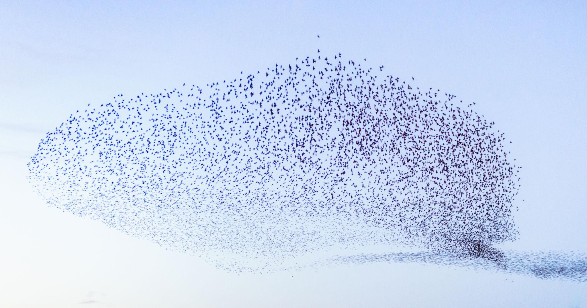

Flocks of birds tend to move in "murmurations": large, interconnected formations that look like amorphous blobs, essentially functioning like a point cloud where they all form a connected, semi-smooth shape. Murmurations have been studied extensively, and a common simulation model called "Boids" exists to model this phenomenon. A biological emergent behavior, a few Bird biology principles combine to form these "volume" - Cohesion: Birds tend to maintain unity rather than flying independently; Separation: Birds avoid collisions by keeping a pocket of personal space; Decentralization: There is no obvious leader, which makes maintaining cohesion unique; Alignment: They share the same level of alignment in terms of direction and speed; and Hyper-localization: Research shows that birds in these formations only respond to a relatively small number of nearby neighbors rather than the movements of the entire flock. The math behind this is fascinating, as it usually is with emergent biological behaviors.

Because there is no apparent leader, and birds on one side perceive things differently or make local judgments while still being influenced by the rest, these flocks are very fluid objects/bodies/volumes. They can deform and reform adaptively around obstacles. I think it would be really cool to see if we could get a fleet of drones to act like murmurations when navigating from point to point, both in simulation and in the real world.

Say you have a lot of drones at point A that all need to get to point B. Rather than treating each drone as a node in a larger connected perception and navigation system, where a global controller is continuously planning and coordinating the trajectory of every individual drone, you could instead let each drone operate with relatively limited local perception and only information about the drones around it. A policy (Boids-adjacent, adaptive RL) could govern how each drone should respond to its surroundings and the behavior of its neighbors (cohesion, alignment, separation, obstacle avoidance, goal-directed motion). The idea would be that you don't explicitly plan the route or tell the swarm exactly how to move, you give the swarm a destination and let a coherent trajectory emerge from all of these local decisions. In an ideal case, the swarm could naturally deform around obstacles, split when necessary, and reconverge afterward, producing a global navigation and object avoidance strategy without one explicitly planned.

This allows for really cool movements, such as: A swarm of drones executing a mission while a kinetic counter-UAS interceptor is deployed. The swarm smoothly and fully autonomously carves out space in its "volume" to let the deterrent slip through without doing any damage, all while remaining a continuous, smooth, amorphous body and rejoining once the threat is out of range.

To some extent, I'm still trying to figure out where this fits in a modern industrial setting. One thing that's clear is that this is not an exploratory technology. Fundamentally, these bird swarms have a bias toward cohesion and sticking with the group. Deploying this approach in search-and-rescue, disaster relief, or large-scale inspection settings creates a lot of friction with that core methodology. Instead, one potentially more interesting application of this could be air highways: the aerial analogues of underwater currents, designed for the efficient movement of goods from warehouse to location. But I think there is more to be done in bringing this concept into physical reality.